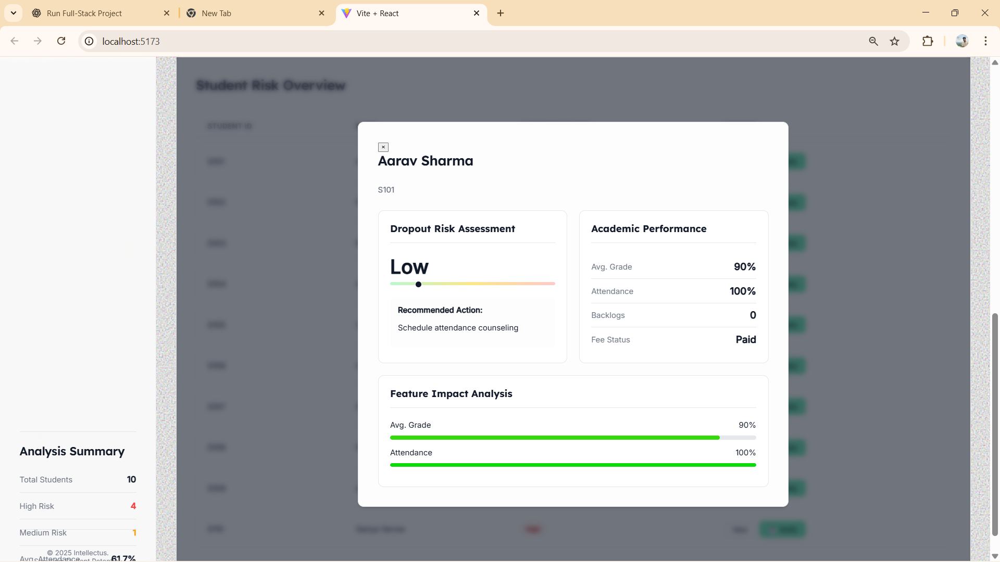

# 📊 Intellectus – Student Risk Analysis System
## 🌐 Live Demo

🔗 https://Anuz-bit.github.io/Intellectus

> Note:  
> The live demo showcases the frontend UI deployed via GitHub Pages.  
> The FastAPI + Machine Learning backend is designed for local execution and is fully documented in this repository.
---
Intellectus is a **student risk analysis web application** that helps educational institutions identify **at-risk students early** using academic and activity data.

The system uses **Machine Learning** to analyze uploaded datasets and provides insights that can support **timely academic interventions**.

---

## 🎯 Project Objective

To proactively identify students who may be at academic risk by analyzing:

* Student information
* Academic performance
* Activity records

This helps teachers and administrators take action **before performance drops further**.

---

## ✨ Features

* Upload multiple student datasets
* Machine Learning-based risk prediction
* Fast and scalable backend using FastAPI
* Modern and responsive frontend
* Simple and clean user interface
* Easy to run locally

---

## 🛠 Tech Stack

### Frontend

* React (Vite)
* Tailwind CSS
* JavaScript

### Backend

* Python
* FastAPI

### Machine Learning

* Pandas
* NumPy
* Scikit-learn
* Joblib

---

## 📁 Project Structure

```
Intellectus/
│
├── backend/
│   ├── venv/                      # Python virtual environment
│   ├── main.py                    # FastAPI backend & ML logic
│   ├── train_model.py             # Model training script
│   ├── student_risk_model.joblib  # Trained ML model
│   ├── feature_names.joblib
│   ├── fee_status_encoder.joblib
│
├── frontend/
│   ├── src/                       # React source code
│   ├── public/
│   ├── package.json
│
└── README.md
```
---
## 🌐 Live Demo

Frontend UI is deployed using GitHub Pages:

🔗 https://Anuz-bit.github.io/Intellectus

> Note:  
> The live demo showcases the frontend interface.  
> The FastAPI + Machine Learning backend is designed to run locally and is documented below.

---

## 🚀 How to Run the Project (Step-by-Step)

### Backend (Local Execution)

The backend includes a FastAPI server and a trained ML model.
Due to GitHub Pages limitations (static hosting), the backend is intended to be run locally.


### ✅ Prerequisites

Make sure the following are installed:

* Python 3.9 or higher
* Node.js (v18+)
* npm

Check versions:

```bash
python --version
node --version
npm --version
```

---

## 🔹 Step 1: Clone the Repository

```bash
git clone <repository-url>
cd Intellectus
```

---

## 🔹 Step 2: Backend Setup (FastAPI)

### 1️⃣ Go to backend folder

```bash
cd backend
```

### 2️⃣ Create virtual environment

```bash
python -m venv venv
```

### 3️⃣ Activate virtual environment

**Windows**

```bash
venv\Scripts\activate
```

You should see `(venv)` in terminal.

---

### 4️⃣ Install backend dependencies

```bash
python -m pip install -r requirements.txt
```

If `requirements.txt` is not present, install manually:

```bash
python -m pip install pandas numpy scikit-learn joblib fastapi uvicorn python-multipart openpyxl
```

---

### 5️⃣ Run backend server

```bash
uvicorn main:app --reload
```

Backend will start at:

```
http://127.0.0.1:8000
```

---

## 🔹 Step 3: Frontend Setup (React)

Open a **new terminal**.

### 1️⃣ Go to frontend folder

```bash
cd frontend
```

### 2️⃣ Install frontend dependencies

```bash
npm install
```

### 3️⃣ Start frontend

```bash
npm run dev
```

Frontend will run at:

```
http://localhost:5173
```

---

## 🔹 Step 4: Use the Application

1. Open browser → `http://localhost:5173`
2. Upload:

   * `students.xlsx`
   * `academic_records.csv`
   * `activity_records.csv`
3. Click **Analyze Data**
4. View student risk analysis results

---

## 📌 Future Enhancements

* Interactive dashboards
* Authentication (Admin / Teacher login)
* Database integration
* Automated alerts
* Cloud deployment

---
Screenshots

## 📸 Screenshots

### Figure 1: Application Home Page & Dataset Upload Interface


---

### Figure 2: Dashboard with Risk Distribution


---

### Figure 3: Student Risk Overview Table


---

### Figure 4: Individual Student Risk Detail View


---

## 👨‍💻 Author

**Anuj Wankhede**
B.Tech Student | Machine Learning & Data Analytics Enthusiast

